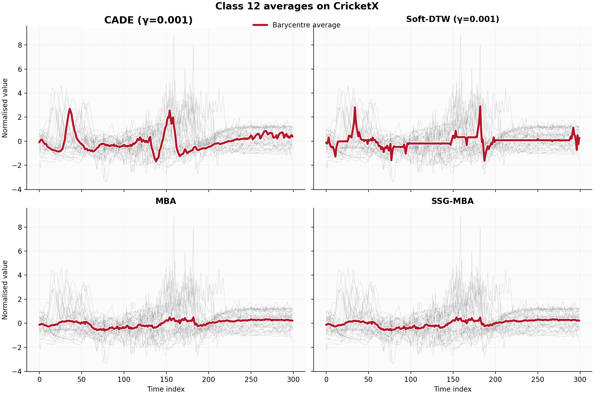

# CADE

Code and results for the paper
**CADE: Context-Aware Differentiable Elastic Alignment for Time Series**
by Christopher Holder, Chuanhang Qiu and Anthony Bagnall (University of Southampton).

CADE is a differentiable elastic alignment loss for time series. It keeps the
move, split and merge structure of the Move-Split-Merge (MSM) distance, and can
be used as a gradient-based loss, for barycentre averaging, and as a soft
alignment matrix for downstream tasks.

## Why CADE?

Elastic distances such as dynamic time warping (DTW) compare series under local
temporal misalignment, but they are not differentiable. Soft-DTW fixed this for
DTW by replacing the hard minimum in its dynamic programme with a soft minimum.
That trick is not enough for MSM. MSM charges split and merge operations a cost
that depends on the local context: whether a value lies *between* two
neighbouring aligned values. That piecewise test is a second, local source of
non-differentiability that a soft minimum does not remove.

CADE removes all three sources of non-differentiability in MSM:

1. **Local distance.** Absolute differences are replaced with squared differences.
2. **Dynamic-programming minimum.** The hard minimum is replaced with the soft
   minimum used by Soft-DTW.
3. **Context-aware transition cost.** MSM's between-value test is replaced with
   a smooth between-gate, the central contribution of the paper.

With $a = x - y$, $b = x - z$ and $u = ab$, the gate and transition cost are

$$
g(x, y, z) = \tfrac{1}{2}\left(1 - \frac{u}{\sqrt{u^2 + \varepsilon}}\right),
\qquad
\mathrm{trans}_\gamma(x, y, z; c) = c + \bigl(1 - g(x, y, z)\bigr)\,
\mathrm{softmin}_\gamma\bigl((x-y)^2, (x-z)^2\bigr).
$$

$g \approx 1$ when $x$ lies between $y$ and $z$ (cost close to the fixed
penalty $c$) and $g \approx 0$ otherwise. The CADE cost matrix is then

$$
C_{i,j} = \mathrm{softmin}_\gamma
\begin{cases}
(x_i - y_j)^2 + C_{i-1,j-1} \\
\mathrm{trans}_\gamma(x_i, x_{i-1}, y_j; c) + C_{i-1,j} \\
\mathrm{trans}_\gamma(y_j, y_{j-1}, x_i; c) + C_{i,j-1}
\end{cases}
$$

and the loss is $C_{m,n}$. A backward recursion gives the soft alignment matrix
and the gradient with respect to the input series. CADE keeps the
$\mathcal{O}(mn)$ time complexity of MSM. CADE is not an exact relaxation of
MSM: as $\gamma, \varepsilon \to 0$ it approaches an MSM-style recursion with
squared rather than absolute local costs.

## Headline results

**Averaging (112 UCR datasets).** CADE barycentres (CADE-BA) are evaluated
under the hard MSM Fréchet loss against MSM Barycentre Averaging (MBA) and a
stochastic subgradient method (SSG-MBA). The Soft-DTW barycentre under DTW
loss is shown for comparison. Each cell is the percentage of datasets on which
the soft method achieves lower loss.

| $\gamma$ | Soft-DTW vs DBA | Soft-DTW vs SSG-DBA | **CADE vs MBA** | **CADE vs SSG-MBA** |
|---------:|----------------:|--------------------:|----------------:|--------------------:|
| 1        | 2.8%            | 14.7%               | 7.3%            | 26.6%               |
| 0.1      | 48.6%           | 49.5%               | 94.5%           | 96.3%               |
| 0.01     | 86.2%           | 78.9%               | 97.2%           | 100.0%              |
| 0.001    | 93.6%           | 83.5%               | 97.2%           | 100.0%              |

**Clustering and classification.** In $k$-means, CADE-BA centroids are
significantly better than $k$-Shape on clustering accuracy and ARI, and
significantly better than Soft-DBA on clustering accuracy. In nearest-centroid
classification, both CADE-BA variants are significantly better than the
corresponding Soft-DBA variants.

**Imbalanced classification (60 UCR problems, HIVE-COTE 2.0).** Replacing the
hard MSM alignment path in e-SMOTE with the CADE alignment matrix
(CADE-e-SMOTE) gives the best balanced accuracy and F1 of all rebalancing
methods tested. The drop in accuracy is not statistically significant. The
CADE-e-SMOTE code is not yet in this repository (see [TODO](#todo)).

| Metric         | No rebalancing | CFAMG  | OHIT   | TSMOTE | e-SMOTE | **CADE-e-SMOTE** |
|----------------|---------------:|-------:|-------:|-------:|--------:|-----------------:|
| Accuracy       | 93.89%         | 93.80% | 93.55% | 93.80% | 93.93%  | 93.01%           |
| Balanced acc.  | 75.60%         | 75.69% | 76.42% | 75.63% | 74.95%  | **80.00%**       |
| F1             | 59.23%         | 59.44% | 60.36% | 59.72% | 58.17%  | **66.83%**       |

**Interpretable prototypes.** On CricketX class 12 (the umpire's "six" signal,
both arms raised), CADE recovers a clear peak for each hand. The other methods
recover this structure less clearly.



## Installation

Requires Python 3.10+. To use CADE as a loss, install it with the backend you want:

```bash
pip install "cade[pytorch] @ git+https://github.com/TonyBagnall/CADE"
```

Swap `pytorch` for `jax` or `tensorflow`, or use `all` for all three. The loss has
no other dependencies.

To reproduce the paper or work on the code, clone the repository and pick the
extra for your task:

```bash
git clone https://github.com/TonyBagnall/CADE.git
cd CADE
pip install -e ".[notebook]"      # run notebooks/reproduce_paper.ipynb
pip install -e ".[experiments]"   # run cade/experiments
pip install -e ".[dev]"           # experiments, all backends, and test/lint tools
```

| Extra         | Adds                                                                         |
|---------------|------------------------------------------------------------------------------|
| `pytorch`     | PyTorch                                                                      |
| `jax`         | JAX                                                                          |
| `tensorflow`  | TensorFlow (Linux x86_64 or macOS arm64, Python < 3.13)                      |
| `all`         | all three backends                                                           |
| `notebook`    | PyTorch, aeon ≥ 1.5, Jupyter and plotting libraries                          |
| `experiments` | PyTorch, the aeon development branch with soft MSM, tsml-eval, python-dotenv |
| `dev`         | `all` + `experiments`, plus pytest, black, flake8, mypy and pre-commit       |

> **Note.** Until CADE is in a released version of aeon, `experiments` and `dev`
> install aeon from the `soft-msm-experiments` development branch, while `notebook`
> needs released aeon. Install them in separate environments. See [TODO](#todo).

## Usage

Every backend exposes the loss, the soft alignment matrix and the gradient with
respect to `x`. Inputs have shape `(batch, channels, length)`, and the two
series may differ in length. The PyTorch, TensorFlow and JAX backends are
currently univariate: only channel 0 is used. `c` is the split/merge penalty and
`gamma` the smoothing parameter.

| Backend    | Module            | Loss                         | Alignment matrix        | Gradient      |
|------------|-------------------|------------------------------|-------------------------|---------------|
| PyTorch    | `cade.torch`      | `CADELoss` (`nn.Module`)     | `cade_alignment_matrix` | `cade_grad_x` |
| TensorFlow | `cade.tensorflow` | `CADELoss`                   | `cade_alignment_matrix` | `cade_grad_x` |
| JAX        | `cade.jax`        | `cade_loss`                  | `cade_alignment_matrix` | `cade_grad_x` |
| Numba      | `cade.numba`      | re-exports aeon's `soft_msm_*` functions |             |               |

PyTorch example:

```python
import torch
from cade.torch import CADELoss, cade_alignment_matrix, cade_grad_x

x = torch.randn(4, 1, 50, dtype=torch.float64, requires_grad=True)
y = torch.randn(4, 1, 60, dtype=torch.float64)

loss = CADELoss(c=1.0, gamma=0.1)(x, y)   # reduction: "mean" | "sum" | "none"
loss.backward()                           # gradients flow to x

E, s = cade_alignment_matrix(x.detach(), y, c=1.0, gamma=0.1)  # E: (4, 50, 60), s: (4,)
dx, s = cade_grad_x(x.detach(), y, c=1.0, gamma=0.1)           # dx: same shape as x
```

JAX example:

```python
import jax

jax.config.update("jax_enable_x64", True)

from cade.jax import cade_loss

key_x, key_y = jax.random.split(jax.random.PRNGKey(0))
x = jax.random.normal(key_x, (4, 1, 50))
y = jax.random.normal(key_y, (4, 1, 60))

dx = jax.grad(lambda x_: cade_loss(x_, y, c=1.0, gamma=0.1))(x)  # same shape as x
```

## Reproducing the paper

[`notebooks/reproduce_paper.ipynb`](notebooks/reproduce_paper.ipynb) regenerates
the paper's results from the summary CSVs in `results/`:

- Table 1 (averaging) and Table 2 (k-means inertia), reproduced exactly;
- the clustering and classification critical difference diagrams (Figures 3
  and 4) and pairwise accuracy scatter plots, drawn with aeon's
  `plot_critical_difference` and `plot_pairwise_scatter`, together with the
  pairwise Wilcoxon p-values behind them;
- a walk-through of CADE itself: the smooth between-gate, alignment matrices, and
  a check of the gradient against autograd and finite differences.

These sections run in seconds with no datasets needed:

```bash
pip install -e ".[notebook]"
jupyter notebook notebooks/reproduce_paper.ipynb
```

The notebook also has an optional cell that regenerates the CricketX prototypes
(Figure 2) from the raw data. That cell needs the soft MSM distance from the aeon
development branch, which released aeon does not include.

## Re-running the experiments

Experiment scripts live in `cade/experiments/`. Install with
`pip install -e ".[experiments]"`. They use UCR datasets stored locally; copy
`.env.example` to `.env` and set:

```bash
DATASET_PATH=/path/to/datasets
RESULT_PATH=/path/to/results
```

| Experiment     | Command                                                                                                    |
|----------------|------------------------------------------------------------------------------------------------------------|
| Averaging      | `python -m cade.experiments._averaging_experiment <distances_csv> <averaging_method> <repeats> <combine_test_train>` |
| Clustering     | `python -m cade.experiments._clustering_experiment <dataset> <model> <combine_test_train> <dataset_path> <results_path> [gamma]` |
| Classification | `python -m cade.experiments._classification_experiment <dataset> <model> <dataset_path> <results_path> [gamma]` |

Model names are the keys in `CLUSTERING_EXPERIMENT_MODELS` and
`CLASSIFICATION_EXPERIMENT_MODELS`. For example, `CADE-BA` and `CADE-BA-hard-dist`
for clustering, and `NearestCentroid-CADE-BA`, `NearestCentroid-CADE-BA-hard-dist` and
`KNN-CADE` for classification, alongside the Soft-DTW, MSM and DTW baselines.
The averaging and forecasting scripts have a `RUN_LOCALLY` flag at the top of
the file; set it to `False` to use command-line arguments.

Summary results used in the paper are in `results/`:

- `results/averaging/`: final barycentre losses for the MSM and DTW geometries.
- `results/classification/`: mean accuracy and balanced accuracy per dataset.
- `results/clustering/`: mean ARI, AMI, NMI, clustering accuracy and inertia per dataset.

Scripts for turning these into the paper's tables and figures are in
`cade/evaluation/`.

## Repository layout

```
cade/
├── torch/          PyTorch implementation of CADE and Soft-DTW (+ tests)
├── tensorflow/     TensorFlow implementation of CADE and Soft-DTW (+ tests)
├── jax/            JAX implementation of CADE and Soft-DTW (+ tests)
├── numba/          re-exports of aeon's Numba soft distances
├── experiments/    averaging, clustering, classification and forecasting experiments
├── evaluation/     result parsing, tables and plots
└── custom_models/  MLP forecaster used in the forecasting experiments
notebooks/          reproduce_paper.ipynb: tables, figures and CADE walk-through
results/            summary results reported in the paper
```

## TODO

### aeon

- [ ] **Fix the aeon dependency.** The pinned `soft-msm-experiments` branch fails on
  import: `aeon/distances/elastic/soft/_soft_msm.py` and
  `aeon/clustering/averaging/_ba_soft.py` import `aeon.utils.numba._threading`,
  which does not exist on the branch. This breaks `cade.numba`, the experiment
  scripts and the tests.
- [ ] **Get CADE into released aeon.** Merge the soft MSM (CADE) distance,
  alignment matrix, gradient and soft barycentre averaging into aeon. Released
  aeon 1.5 includes Soft-DTW but not soft MSM.
- [ ] **Switch to a released aeon.** Once CADE is released, replace the git
  dependency in `pyproject.toml` with `aeon>=<version>`. Update the re-exports in
  `cade/numba/__init__.py`, and the `"soft_msm"` distance strings in
  `cade/experiments/`, to aeon's final names.
- [ ] **Run the full test suite** against that aeon release, with all backends
  installed.

### Paper and code consistency

- [ ] **CADE-e-SMOTE.** Add the rebalancing code (e-SMOTE with the CADE alignment
  matrix replacing the hard MSM path) and the benchmark on 60 imbalanced UCR
  problems. Add the HIVE-COTE 2.0 results (Table 3, Figures 5 and 6) and the
  $\gamma$ sensitivity analysis to `results/`, and fill in section 5 of the
  reproduction notebook.
- [ ] **Timing results.** Add the runtime experiment behind the complexity
  section (series lengths 32 to 1024 for DTW, Soft-DTW, MSM and CADE) and its results.
- [ ] **Gate smoothing parameter.** The paper states $\varepsilon = 10^{-12}$;
  the PyTorch, TensorFlow and JAX implementations use `eps=1e-9`. Make them agree.
- [ ] **Multivariate series.** The paper says the implementation supports
  multivariate series, but the PyTorch, TensorFlow and JAX backends only use
  channel 0. Implement multichannel support or correct the paper.
- [ ] **Clustering results.** `results/clustering/` covers 90 datasets; the paper
  reports 112. Add the missing datasets or update the paper.
- [ ] **Clustering significance claim.** The paper says CADE-BA is significantly
  better than Soft-DBA on clustering accuracy. On the committed results the direct
  one-sided Wilcoxon test gives p = 0.052, above aeon's threshold of 0.033. The two
  methods are separated in the CD diagram only by clique propagation (see the
  notebook). Reword the claim or rerun on the full 112 datasets.

### Housekeeping

- [ ] **Forecasting losses.** `cade_loss_factory` and `soft_dtw_loss_factory` in
  `cade/experiments/_forecasting_models.py` are stubs that return `nn.MSELoss()`.
  Wire in `cade.torch.CADELoss` and `SoftDTWLoss`.
- [ ] **Experiment CLIs.** Replace the `RUN_LOCALLY` flags with proper
  command-line arguments. The classification script's usage message lists
  `<gamma>` third, but the script reads it as the last, optional argument.

## Running the tests

The backend tests check each implementation against the aeon reference
implementation:

```bash
pip install -e ".[dev]"
pytest
```

## Citation

If you use CADE, please cite:

```bibtex
@unpublished{holder2026cade,
  title  = {{CADE}: Context-Aware Differentiable Elastic Alignment for Time Series},
  author = {Holder, Christopher and Qiu, Chuanhang and Bagnall, Anthony},
  year   = {2026},
  note   = {Manuscript}
}
```

## Contact

Anthony Bagnall (corresponding author), a.j.bagnall@soton.ac.uk
